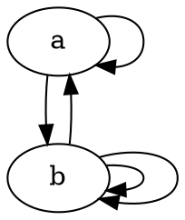
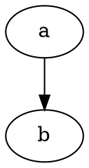
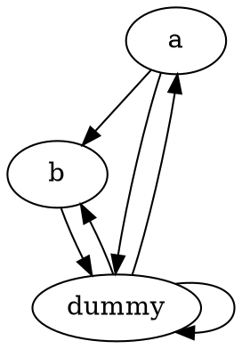

# PageRank

---

## Basic Algorithm

 * Let $c_{p,t}$ be the credit of page $p$ at time $t$. Let $n_p$ be the number of outgoing links on page $p$.
 * Each page starts with credit $1$; that is, $c_{p,0}:=1$.
 * At each time step, each page sends all its credit, equally split among its outgoing links; that is, $$c_{q,i+1}:=\sum_{p\to q} \frac{c_{p,i}}{n_p}$$
 * The PageRank of page $p$ is $c_{p,\infty}$.

---

## Question

Calculate PageRanks for the following Web:

$$
\begin{align}
c_{a,i+1} &:= \frac{1}{2} c_{a,i} + \frac{1}{3} c_{b,i} \\
c_{b,i+1} &:= \frac{1}{2} c_{a,i} + \frac{2}{3} c_{b,i}
\end{align}
$$

---

## Answer

$$
\begin{align}
c_{a,i+1} &:= \frac{1}{2} c_{a,i} + \frac{1}{3} c_{b,i} \\
c_{b,i+1} &:= \frac{1}{2} c_{a,i} + \frac{2}{3} c_{b,i}
\end{align}
$$

$$
\begin{align}
c_{a,\infty} &= \frac{1}{2} c_{a,\infty} + \frac{1}{3} c_{b,\infty} \\
c_{b,\infty} &= \frac{1}{2} c_{a,\infty} + \frac{2}{3} c_{b,\infty}
\end{align}
$$

---

## Answer (continued)

*Both* equalities
$$
\begin{align}
c_{a,\infty} &= \frac{1}{2} c_{a,\infty} + \frac{1}{3} c_{b,\infty} \\
c_{b,\infty} &= \frac{1}{2} c_{a,\infty} + \frac{2}{3} c_{b,\infty}
\end{align}
$$
simplify to
$$
\frac{1}{2} c_{a,\infty} = \frac{1}{3} c_{b,\infty}
$$
which means that the system is underdetermined.

---

## Answer (continued)

We add a normalization constraint. The solution of
$$
\begin{aligned}
\frac{1}{2} c_{a,\infty} - \frac{1}{3} c_{b,\infty} &= 0\\
c_{a,\infty} + c_{b,\infty} &= 2
\end{aligned}
$$

is

$$c_{a,\infty}=4/5 \qquad c_{b,\infty}=6/5$$

---

## Question

What about the following Web?

$$\begin{aligned}
c_{a,i+1} &:= 0 \\
c_{b,i+1} &:= c_{a,i}
\end{aligned}$$

Since $a$ has no outgoing link, its credit gets lost!

---

## Our (Quick) Fix

To avoid leaking credit, we
 * add a dummy webpage 
 * add a link from each page to the dummy
 * add a link from the dummy to each non-dummy

---

## "Fixed" Web

Exercise: Compute PageRanks on this example.

---

## More Information

 * [Mining Massive Data Sets](http://infolab.stanford.edu/~ullman/mmds/ch5.pdf) (Chapter on Link Analysis)
 * [Linear Algebra Tutorial](https://www.khanacademy.org/math/linear-algebra) (at Kahn Academy)

---

###### tags: `plad`
